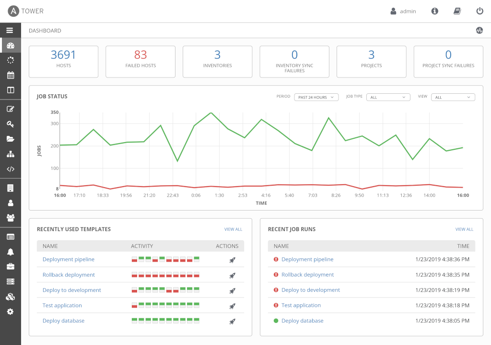

# Formation Ansible

### Initiation, concepts, fonctionnement

Version 1.0

2021/04/18

Licence CC [BY-SA 4.0](Licence CC BY-SA 4.0)

---

## Sommaire

- Introduction à Ansible
- L'inventaire
- Un premier Playbook
- Les rôles
- Quelques bonnes pratiques et conseils

---

# Introduction à Ansible

- Introduction et histoire
- Les concepts
- Démarrage rapide
- Les commandes Ansible
- Récapitulatif

---

## Introduction et histoire

- Outil d’automatisation et de déploiement créé en février 2012 par Michael DeHaan
- Rachat de AnsibleWorks Inc. en 2015 par Red Hat.
- Ecrit en Python et distribué sous licence GNU GPL v3
- Disponible en natif sur les principales distributions Linux du marché
- Ansible travaille majoritairement avec Linux et Unix, mais aussi Microsoft Windows

---

## Les concepts

- Pas d'agent à installer, Ansible n'a besoin que de Python et SSH
- Architecture décentralisée, n'importe quel poste de travail peut faire un déploiement
--

😮

Une machine Windows ne peut pas être contrôleur Ansible.

--

## Architecure Ansible


---

## Les principes clés

- Conception minimaliste
- Homogénéité
- Sécurité
- Fiabilité
- Apprentissage rapide

Note:
- Conception minimaliste : les systèmes gérés ne requièrent aucun composant supplémentaire. Seul le contrôleur peut avoir besoin de modules complémentaires selon les besoins. (exemple : modules python-docker pour piloter des containers de ce type)
- Homogénéité : un déploiement Ansible permet de déployer des environnements homogènes et cohérents.
- Securité : Ansible ne nécessite pas d’agent sur les noeuds, il n’a besoin que d’une connexion SSH et Python installé dessus.
- Fiabilité : Ansible repose sur le principe d'indempotence et l’écriture des playbooks se doit d’appliquer cette règle pour garantir que l’exécution sur un noeud aura systématiquement le même résultat.
- Apprentissage rapide : Les playbooks Ansible sont écrits en YAML et en templates Jinja, des syntaxes strictes mais simples à maîtriser et faciles à lire même pour un non initié.

---

## Jargon Ansible

- Le contrôleur
    -   Machine qui lance le déploiement Ansible
- Noeuds managés / "hosts"
    -   Machines de l'inventaire Ansible qui sont ciblées par le déploiement
- L'inventaire
    -   Liste de hosts pouvant être hiérarchisée et triée par groupements

--

- Module
    - Code exécuté par une tâche Ansible
- Tâche
    - Unité d'action d'Ansible, une tâche lance un module
- Playbook
    - Ensemble de tâches ordonnées permettant d'exécuter des actions dans l'ordre du script
- Rôles
    - Ensemble de fichiers normalisé pouvant contenir des tâches, des variables, etc, et réutilisables pour être appelés dans un ou plusieurs playbooks

---

## Démarrage rapide

---

### Prérequis du contrôleur

- OS basé sur Linux (REHL, Debian, CentOS, Fedora..) ou Unix (BSD, MacOS..)
- Python 2.7 ou Python 3.5+
- Être au plus proche du réseau des cibles
- Potentiellement des modules Python spécifiques requis par un module Ansible
    - Ex : le module `community.general.dig` requiert `dnspython`

--

### Prérequis des hosts

- Une connexion SSH
- Python 2.6+ ou Python 3.5+
- Si SELinux est activé, le package `libselinux-python` doit être installé
- L'interpréteur Python par défaut est `/usr/bin/python`, il peut nécessiter une adaptation sur la config du contrôleur

Note:
Ansible utilise par défaut SFTP, mais il peut passer en SCP si besoin
SELinux : le package peut parfaitement être installé par Ansible avant d'utiliser des modules en ayant besoin

---

### Installer Ansible

- Ansible est nativement disponible dans les repositories de plusieurs distributions Linux.
- Il peut être installé avec l'utilitaire `pip` de Python
- Il peut être installé via les sources

```bash
# avec dnf sur Fedora Linux
$ dnf install ansible

# avec le gestionnaire de paquets Python pip
$ pip install ansible-base
```

[Documentation officielle : Installation Guide](https://docs.ansible.com/ansible/latest/installation_guide/intro_installation.html#installation-guide)

---

### Configurer Ansible

La configuration Ansible se fait au moyen d'un fichier `ansible.cfg` chargé selon cet ordre de priorité :

1. variable d’environnement `ANSIBLE_CONFIG` avec l’emplacement du fichier
2. `ansible.cfg` dans le répertoire courant où est exécuté la commande ansible
3. `~/.ansible.cfg` depuis le répertoire home
4. `/etc/ansible/ansible.cfg`

--

- Le fichier `ansible.cfg` est un fichier texte au format `ini`
- Chacune de ses valeurs peut être surchargée par une variable d'environnement qui sera prioritaire

---

### Executer une première commande

--

### Création d'un inventaire de test

- Dans un fichier `inventory` nous mettons la liste de nos serveurs.

```ini
192.168.1.20
192.168.1.22
```
--

### Exécuter une commande ansible


```bash
$ ansible -i inventory all -m ping

192.168.1.20 | SUCCESS => {
    "changed": false,
    "ping": "pong"
}
192.168.1.22 | SUCCESS => {
    "changed": false,
    "ping": "pong"
}
```

Note:
Le module ping d'Ansible permet de valider : 
- La bonne lecture de l'inventaire
- La connexion SSH
- L'exécution de script 

---

### Comprendre l'élévation de privilège

- Pour faire certaines actions, Ansible aura parfois besoin de se connecter avec un utilisateur à privilèges
    - Ex :root, sysadmin, ...
- Ou avec un utilisateur spécifique
    - Ex : apache, tomcat, postgres...
- Cela se gère avec les instructions `become` et `become_user`

--

#### Par défaut, Ansible se connecte avec l'utilisateur courant

```bash
# je suis connecté sur mon contrôleur avec user1
[user1@localhost ~]$ ansible -i inventory all -m command \
-a "whoami"

192.168.1.20 | CHANGED | rc=0 >>
user1
192.168.1.22 | CHANGED | rc=0 >>
user1
```

--

#### Pour devenir root sur les hosts

```bash
[user1@localhost ~]$ ansible -i inventory all -m command \
-a "whoami" --become

192.168.1.20 | CHANGED | rc=0 >>
root
192.168.1.22 | CHANGED | rc=0 >>
root
```

--

#### Pour devenir un autre utilisateur sur les hosts

```bash
[user1@localhost ~]$ ansible -i inventory all -m command \
-a "whoami" --become --become-user jeanmichel

192.168.1.20 | CHANGED | rc=0 >>
jeanmichel
192.168.1.22 | CHANGED | rc=0 >>
jeanmichel
```

--

Lien utile : [Understanding privilege escalation](https://docs.ansible.com/ansible/latest/user_guide/become.html#become)

---

## Les commandes Ansible

Lien utile : [Working with command line tools](https://docs.ansible.com/ansible/latest/user_guide/command_line_tools.html)

--

### ansible

- Commande de base permettant l'exécution ad-hoc d'un module Ansible
 
```bash
$ ansible -i inventory webservers -m service \
-a "name=httpd state=restarted"
```

--

### ansible-config

- Retourne la configuration courante d'Ansible et le fichier de config utilisé

```bash
$  ansible-config dump
ACTION_WARNINGS(default) = True
AGNOSTIC_BECOME_PROMPT(default) = True
ALLOW_WORLD_READABLE_TMPFILES(default) = False
(...)
```

--

### ansible-console

- Lance une console interactive sur les hosts ciblés permettant d'exécuter des modules
- La console sait aussi interpréter des commandes shell
- Peut être utilisé comme outil d'admin pour redémarrer des services en masse par exemple

```bash
$ ansible-console -i inventory webservers
```

--

### ansible-doc

- Retourne la documentation d'un module ansible

```bash
ansible-doc yum
> YUM    (/usr/lib/python3.7/site-packages/ansible/modules/packaging/os/yum.py)

        Installs, upgrade, downgrades, removes, and lists packages and groups with the `yum' package manager. This module only works on Python 2. If you require Python 3 support see the
        [dnf] module.

  * This module is maintained by The Ansible Core Team
  * note: This module has a corresponding action plugin.

(...)
```

--

### ansible-galaxy

- Commande permettant de s'interfacer avec les [repos publics](https://galaxy.ansible.com/) de rôles Ansible
- Elle permet aussi d'initialiser la structure de fichiers d'un rôle

```bash
$ ansible-galaxy init mon_nouveau_role --offline
- Role mon_nouveau_role was created successfully

$ tree mon_nouveau_role/
mon_nouveau_role/
├── defaults
│   └── main.yml
├── files
├── handlers
│   └── main.yml
(...)
```

--

### ansible-inventory

- Permet d'afficher l'inventaire et les variables comme Ansible le verrait durant l'exécution
- Utile pour contrôler la qualité d'une config de déploiement
 
--

### ansible-playbook

- Commande permettant d'exécuter un playbook
- Elle ressemble à la commande ad-hoc `ansible` mais certains de ses entrants sont inscrits dans le code du playbook

```bash
$ ansible-playbook -i inventory mon_playbook.yml
```

--

### ansible-pull

- Permet d'exécuter des scripts Ansible depuis un gestionnaire de sources (git, etc)

--

### ansible-vault

- Permet de chiffrer des fichiers Ansible contenant des secrets
- Un mot de passe est requis pour manipuler les fichiers chiffrés ensuite

```bash
# on affiche l'inventaire actuel
$ cat inventory

192.168.1.20
192.168.1.22

# on le chiffre en specifiant un mot de passe
$ ansible-vault encrypt inventory --ask-vault-pass

# on reaffiche le fichier
$ cat inventory

$ANSIBLE_VAULT;1.1;AES256
643834373838393832346161393539(...)
```

---

## Introduction à Ansible - récap

- Ansible est un logiciel libre de déploiement écrit en Python utilisable sous Linux et Unix
- Il ne requiert pas d'agent ou de logiciel particulier en dehors de Python et une connexion SSH
- Il travaille avec un inventaire de machines
- Il dispose de plusieurs outils en ligne de commande

--


---

# L'inventaire Ansible

- Introduction à l'inventaire
- Le groupement de hosts
- Les variables d'inventaire
- group_vars, hosts_vars, et variables liées à un inventaire
- Récapitulatif

---

## Introduction à l'inventaire Ansible

- L'inventaire est une liste de hosts au format `INI` ou `YAML`
- Il permet de trier ses hosts selon ses besoins de déploiement
- Il permet d'appliquer des valeurs spécifiques à des hosts
- Il permet de contextualiser une exécution Ansible à un inventaire

--

### Inventaire au format INI

```ini
mail.example.com

[webservers]
foo.example.com
bar.example.com

[dbservers]
one.example.com
two.example.com
three.example.com
```

--

### Inventaire au format YAML

```yaml
all:
  hosts:
    mail.example.com:
  children:
    webservers:
      hosts:
        foo.example.com:
        bar.example.com:
    dbservers:
      hosts:
        one.example.com:
        two.example.com:
        three.example.com:
```
--

⚠⚠⚠

L'écriture de l'inventaire Ansible est un élément important qui nécessite une 
réflexion à part entière.

La façon dont l'inventaire est écrit peut conditionner comment le développement
des scripts sera fait.

---

## Le groupement de hosts

- Ansible permet de répartir des hosts par groupes
- Un groupe peut être la cible d'un déploiement, plutôt qu'une liste de hosts
- Il existe deux groupes internes Ansible auto générés :
    - *all* : Retourne tous les hosts de l'inventaire sans exception
    - *ungrouped* : Retourne uniquement les hosts qui sont membres d'aucun groupe
- On peut créer des groupes de groupes grâce à l'instruction `children`

--

### Exemple de groupement de hosts

- Notre infra à gérer avec Ansible est composée de serveurs Web et Base de données
- Notre infra existe en France et en Allemagne
- Nous voulons pouvoir cibler à un moment les serveurs Web français, puis les allemands.
- Même chose pour les bases de données

--

### Exemple de groupement au format INI

```ini
[all_countries:children]
fr_all
de_all

[fr_all:children]
fr_webservers
fr_databases

[de_all:children]
de_webservers
de_databases

[webservers:children]
fr_webservers
de_webservers

[databases:children]
fr_databases
de_databases

[fr_webservers]
web1.fr.example.com
web2.fr.example.com

[de_webservers]
web1.de.example.com
web2.de.example.com

[fr_databases]
db1.fr.example.com
db2.fr.example.com

[de_databases]
db1.de.example.com
db2.de.example.com
```

---

## Les variables d'inventaire

- On peut assigner des variables à un host présent dans l'inventaire
- Utile pour appliquer une ou deux variables spécifiques

```ini
web1.fr.example.com http_port=80
web2.fr.example.com http_port=81
```

--

- On peut aussi définir des variables qui seront utiles à Ansible
- Exemple avec le port SSH et l'utilisateur de connexion :

```ini
web1.fr.example.com ansible_port=1234 ansible_user=user1
web2.fr.example.com ansible_port=2222 ansible_user=user2
```

---

## group_vars, hosts_vars, et inventaire

- Si le déploiement requiert de gérer beaucoup de variables, il convient d'utiliser les fichiers `group_vars` et/ou `hosts_vars`.
- Il s'agit d'un ensemble de fichiers normalisé dans lequel on peut positionner des variables de déploiement
- Ansible charge ces valeurs selon un ordre de priorité précis

--

```ini
inventory/
    production/
        hosts #ce fichier contient l'inventaire
        group_vars/
            all.yml #ce fichier contient des variables applicables à l'ensemble des hosts de l'inventaire
            webservers.yml # ce fichier contient des variables applicables uniquement aux membres du groupe webservers
            databases.yml # ce fichier contient des variables applicables uniquement aux membres du groupe dbservers
        hosts_vars/
            all.yml #ce fichier contient des variables applicables à l'ensemble des hosts de l'inventaire
            web1.fr.example.com # contient des variables spécifiques à ce serveur
    preprod/
        hosts #ce fichier contient l'inventaire
        group_vars/
            all.yml #ce fichier contient des variables applicables à l'ensemble des hosts de l'inventaire
            webservers.yml # ce fichier contient des variables applicables uniquement aux membres du groupe webservers
            databases.yml # ce fichier contient des variables applicables uniquement aux membres du groupe dbservers
```

--

- La structure de dossiers `group_vars` et `hosts_vars` permet de contextualiser le code Ansible exécuté
- Cela évite de mettre des conditions en dur dedans et permet d'avoir le code le plus agnostique possible
- Pour contextualiser le code, il suffit de choisir l'inventaire approprié

```bash
# en prod
ansible-playbook -i inventory/production/hosts monplaybook.yml

# en preprod
ansible-playbook -i inventory/preprod/hosts monplaybook.yml
```

---

## L'inventaire Ansible - Récap

- L'inventaire est la liste des hosts sur lesquels agir
- Il permet de porter tout un ensemble de variables pour contextualiser le code
- Il se compose d'un ensemble de fichiers à la structure normée
- Il est important de bien construire son inventaire avant de se lancer dans le codage

--


---

# Un premier playbook

- Qu'est-ce qu'un playbook
- Déclarer les hosts et utilisateurs
- Déclarer les tâches
- Les handlers pour exécuter une action sur changement

---

## Qu'est-ce qu'un playbook

- C'est un ensemble de tâches Ansible qui seront exécutées dans l'ordre du script
- Ils représentent un scénario de déploiement entier
- Ils peuvent exécuter des actions sur événement
- Ils sont écrits en YAML
- Les instructions sont un langage déclaratif propre à Ansible
- Ils peuvent contenir des variables et des paramètres

--

### Exemple de playbook

```yaml
- hosts: webservers
  vars:
    http_port: 80
    max_clients: 200
  remote_user: root
  tasks:
  - name: ensure apache is at the latest version
    yum:
      name: httpd
      state: latest
  - name: write the apache config file
    template:
      src: /srv/httpd.j2
      dest: /etc/httpd.conf
    notify:
    - restart apache
  - name: ensure apache is running
    service:
      name: httpd
      state: started
  handlers:
    - name: restart apache
      service:
        name: httpd
        state: restarted
```

---

## Détaillons le contenu d'un playbook

- Un playbook contient à minima deux instructions :
 - *hosts* : Pour savoir sur quels hosts déployer
 - *tasks* : Pour lui dire quoi faire

--

### Déclaration des hosts et utilisateurs

- Le playbook commencera toujours par `- hosts:`
- Il s'agit du nom du groupe de hosts présent dans l'inventaire, ou bien de *all*
- On peut aussi spécifier le `remote_user`
    - Il s'agit du user avec lequel Ansible va jouer les actions
    - `remote_user` est optionnel, par défaut Ansible utilisera le profil courant

```yaml
- hosts: webservers
  remote_user: root
```

-- 

- Dans le cas où le *remote_user* n'a pas assez de droits, l'instruction `become: yes`
indique à Ansible de passer en mode *sudo*

```yaml
- hosts: webservers
  remote_user: jeanmichel
  become: yes
```

--

- Si le *remote_user* n'est pas celui avec qui les instructions doivent être
jouées, on le change avec `become_user`

```yaml
- hosts: webservers
  remote_user: jeanmichel
  become: yes
  become_user: maurice
```

--

- Si le besoin d'escalade de privilège n'est pas permanent, on peut l'affecter à une tâche

```yaml
- hosts: webservers
  remote_user: jeanmichel
  tasks:
    - service:
        name: httpd
        state: started
      become: yes
```

---

## La déclaration des tâches

- La liste des tâches d'un playbook se déclare dans la section `tasks:`
- Les tâches sont des appels de modules Ansible
- On peut les configurer avec des entrants, et tester leur sortie

```yaml
tasks:
  service:
    name: httpd
    state: started
```

--

### 👍 Bonne pratique

- Toujours nommer ses tâches en les commençant par l'instruction `name:`

```yaml
tasks:
  - name: "Start httpd"
    service:
      name: httpd
      state: started
```

- Cela permet de les identifier dans la sortie d'exécution
- Cela permet d'utiliser l'option `--start-at-task`

--

### Les paramètres d'une tâche

- Les modules disposent tous de leur propre jeu de paramètre
- Les tâches possèdent aussi des paramètres généraux
    - *tags* : Associe un ou plusieurs tags à une tâche pour les cibler ou les exclure d'une exécution
    - *ignore_errors* : Ignorer les éventuelles erreurs de la tâche
    - *changed_when* / *failed_when* : Conditionner le changement d'état de la tâche
    - ...

--

Lien utile : [Playbooks keywords](https://docs.ansible.com/ansible/latest/reference_appendices/playbooks_keywords.html)

---

## Les handlers

- Les handlers sont des tâches Ansible faisant appel à un module
- Ils se déclenchent via l'instruction `notify` à la fin de l'exécution du playbook
- Ils permettent de lancer des actions "post" après un déploiement Ansible

--

### Exemple de handler

```yaml
tasks:
  - name: "Deploy httpd configuration"
  template:
      src: etc_httpd_conf_httpd.conf.j2
      dest: /etc/httpd/conf/httpd.conf
  notify:
      - reload httpd

# handler pour prise en charge du reload
handlers:
  - name: "reload httpd"
    service:
      name: httpd
      state: reloaded
```

--

### Règles de gestion des handlers

- On peut faire appel au même handler plusieurs fois dans un playbook
    - Mais il ne sera exécuté qu'une seule fois
- L'ordre d'exécution des handlers est celui d'appel dans le playbook, et non leur ordre dans le code
- Les handlers sont exécutés à la fin de TOUS les playbooks.
    - Si le playbook est un agrégat utilisant `import_playbook`, les handlers seront joués après le dernier importé

---

## Un premier playbook - Récap

- Le playbook est le script Ansible à proprement parler
- Il est un ensemble de tâches, variables, et handlers
- Il commence toujours par l'instruction `hosts`, puis `tasks`
- Il peut déclencher des tâches dur événement avec les Handlers
- On peut agréger des playbooks en un seul via la commande `import_playbook`

--


---

# Les rôles Ansible

- Qu'est-ce qu'un rôle Ansible ?
- Comprendre l'interaction avec l'inventaire
- Initialiser un rôle
- Exécuter un rôle

---

## Qu'est-ce qu'un rôle Ansible ?

- Un rôle est un ensemble de scripts Ansible structuré dans une arborescence et avec des nommages précis
- Il s'agit d'un code qui a pour but d'être réutilisable et appelé par des playbooks
- Le rôle peut être vu comme un ensemble de fonctions standard appelées lors de l'exécution et contextualisées par l'inventaire

--

### Structure d'un rôle

```bash
site.yml #playbook
webservers.yml #playbook
fooservers.yml #playbook 
roles/
    common/ #role "common"
        tasks/
        handlers/
        files/
        templates/
        vars/
        defaults/
        meta/
    webservers/ #role "webservers"
        tasks/
        defaults/
        meta/
```

--

- Un rôle n'a pas besoin d'avoir toujours l'ensemble des dossiers
- Un fichier `main.yml` dans un dossier est le minimum requis pour être pris en compte

--

### Les dossiers d'un rôle

- tasks : Les tâches qui seront jouées par le rôle
- handlers : La définition des handlers qui pourront être appelés en fin d'exécution
- defaults : Définition des valeurs par défaut des variables du rôle

-- 

- vars : Définition d'un autre ensemble de variables du rôle
- files : Contient des fichiers statiques qu'Ansible peut copier sur les hosts
- templates : Contient des fichiers dynamiques qu'Ansible peut enrichir lors du dépôt
- meta : Contient des meta-data pour le rôle : licence, dépendances...

--

### 💡 Astuce

`ansible-galaxy init <nomdurole> --offline` permet d'intialiser la structure complète d'un rôle Ansible.

---

## Comprendre les interactions entre inventaires et variables

--

### L'ordre de priorité des variables

- Un rôle peut porter des variables à plusieurs niveaux :
    - dans le fichier `defaults/main.yml`
    - dans le fichier `vars/main.yml`
    - codées dans le rôle (`set_fact`)
    - issues de l'inventaire (group_vars, hosts_vars)
    - passées en ligne de commandes (`--extra-vars`)

--

😬

Ansible possède 22 niveaux de priorité pour charger des variables... !

Lien utile : [Understanding variable precedence](https://docs.ansible.com/ansible/latest/user_guide/playbooks_variables.html#variable-precedence-where-should-i-put-a-variable)


--

### Priorisation de variable les plus courantes

Du plus faible au plus élevé :

1. Valeurs spécifiées dans le defaults
2. Surchargées par le group_vars
3. Surchargées par le hosts_vars
4. Surchargées par un `set_facts` dans le code
5. Surchargées par `--extra-vars` dans la ligne de commande

--

💡

L'argument `--extra-vars` en ligne de commande a la priorité absolue pour définir la valeur d'une variable.

--

👍 Bonne pratique

Toujours donner une valeur default à ses variables, y compris dans un template.

Cela permet d'éviter de revenir sur le code.

--

### Comment Ansible fait le lien entre le group_vars et le rôle

- C'est grâce à l'inventaire qu'Ansible est capable de savoir comment charger les valeurs
- Dans le fichier `hosts` de l'inventaire, nous avons spécifié des noms de groupes
    - Ex : *webservers*, *databases*...
- Les fichiers présents dans `group_vars` sont nommés de la même manière que le groupe
- Les fichiers présents dans `hosts_vars` sont nommés selon le hostname du serveur déployé

--

Playbook :
```yaml
- hosts: webservers
  roles: webservers
```

Inventaire :
```bash
inventory/prod/hosts

[webservers]
webserver1.example.com
webserver2.example.com

# group_vars contenant les variables spécifiques
# pour les webservers
inventory/prod/group_vars/webservers.yml

# hosts_vars qui contient des variables spécifiques à
# un serveur du groupe webservers
inventory/prod/hosts_vars/webserver1.example.com.yml
```

-- 

### En application

- default/main.yml
    - httpd_listen_port: 80

=> Le port 80 sera configuré dans httpd.conf

--

- default/main.yml
    - httpd_listen_port: 80
- group_vars/webservers.yml
    -  httpd_listen_port: 81

=> Le port 81 sera configuré dans httpd.conf

--

- default/main.yml
    - httpd_listen_port: 80
- group_vars/webservers.yml
    -  httpd_listen_port: 81
- hosts_vars/web1.example.com.yml
    -  httpd_listen_port: 82


=> Le port 81 sera configuré dans httpd.conf

=> sauf pour le host `web1` qui aura 82

---

## Initialiser un rôle

- La commande `ansible-galaxy` permet de générer un rôle type
- Un rôle doit toujours se situer dans le dossier `roles/` du répertoire courant d'un playbook
- On peut indiquer à Ansible où trouver les rôles au besoin

```bash
playbook.yml
roles/
    webservers/
        tasks/
        ...
```

--

### Un rôle simple

Création d'un rôle qui va déployer Apache HTTPD avec sa config, et activer le service.

--

### Initialiser le rôle

```bash
$ ansible-galaxy init webserver --offline
- Role webserver was created successfully
```

--

### Mettre les tâches

Dans roles/webserver/tasks/main.yml :

```yaml
- name: "Check host compatibility"
  assert:
    that: ansible_facts['os_family']|lower == 'redhat'
    msg: "Unsupported OS, this role works only for Red Hat family"

- name: "Install apache httpd"
  yum:
    name: "{{ apache_rpm_name }}"
    state: latest

- name: "Deploy httpd.conf"
  template:
    src: etc_httpd_conf_httpd.conf.j2
    dest: /etc/httpd/conf/httpd.conf
    owner: root
    group: root
    mode: '0644'
```

--

💡

Notez que le rôle ne commence pas par l'instruction `hosts`, ni `tasks`.

Ces instructions sont uniquement pour le playbook qui importera le rôle.

Le rôle peut donc enchaîner les tâches une par une.

--

### Faire un template

Dans roles/webserver/template/etc_httpd_conf_httpd.conf.j2

```jinja
(...)
# Change this to Listen on specific IP addresses as shown below to 
# prevent Apache from glomming onto all bound IP addresses.
#
#Listen 12.34.56.78:80
Listen {{ apache_listen_port }}

#
# Dynamic Shared Object (DSO) Support
(...)
```

--

### Valeurs par défaut des variables

Dans roles/webserver/defaults/main.yml

```yaml
apache_rpm_name: httpd
apache_listen_port: 80
```

--

### Création du playbook d'exécution

Au même niveau que le dossier `roles/` créer :
- `deploy_httpd.yml`

```
- hosts: webservers
  roles:
    - webserver
```

--

### Récap des actions du rôle

1. Test si l'OS sur lequel il est exécuté est compatible
2. Installation du package `httpd`
3. Déploiement du template `httpd.conf` en mettant le port d'écoute Apache
4. Le tout exécuté par le playbook `deploy_httpd.yml`

--

## Executer un rôle

- Un rôle est exécuté au travers d'un playbook
- On peut l'importer de plusieurs façons :
    - `roles: nomdurole`
    - `import_role:`
    - `include_role:`

--

```yaml
- hosts: webservers
  roles:
    - webserver # on peut donner une liste de roles à lancer
    - application

# ou

- hosts: webservers
  tasks:
    - import_role:
        name: role1
    - include_role:
        name: role2
```

--

### Nuances import et include_role

- import_role : Le rôle est importé de manière statique
    - Le code est lu avant de l'exécuter pour transmettre à des sous tâches des valeurs calculées
- include_role : Le rôle est importé de manière dynamique
    - Le code est lu durant l'exécution, les options des tâches ne seront pas transmises aux sous tâches

--

💡

Un rôle ne sera exécuté qu'une seule fois par Ansible. 

Si un playbook liste plusieurs fois le rôle, les autres occurrences seront ignorées à moins d'utiliser `duplicates: true` dans `meta/main.yml`

La réexécution est permise si les variables ou paramètres passés aux rôles ont changé par rapport à la précédente.

--

### Les dépendances de rôles

- Le but d'un rôle est d'être réutilisable et le plus spécialisé possible
- Ansible recommande l'approche *keep it simple* pour le développement de ceux-ci
- On peut donner des dépendances à un rôle Ansible
- Cela signifie que le rôle exécutera au préalable ceux indiqués comme étant une dépendance

--

### Déclarer une dépendance

- Dans le fichier `roles/webserver/meta/main.yml`, renseigner le champ `dependencies`

```yaml
dependencies:
  - role: common
```

- A l'exécution, le rôle webserver appelera common en prérequis

---

## Les rôles Ansible - Récap

- Les rôles sont un code Ansible réutilisable réparti dans un ensemble de fichiers normé
- L'exécution est enrichie est contextualisée par les variables d'inventaire ou de hosts
- Ils sont lancés via des playbooks et peuvent être enchaînés

--


---

# Bonnes pratiques, conseils, et compléments

- Quelques bonnes pratiques
- Ansible Lint pour contrôler son code
- Mitogen pour accélérer Ansible
- AWX / Tower

---

## Quelques bonnes pratiques

- La [documentation officielle](https://docs.ansible.com/ansible/latest/user_guide/playbooks_best_practices.html) d'Ansible regroupe un certain nombre de conseils utiles
- Nous allons en voir quelques uns

--

### Organisation de l'arborescence

- Ansible recommande deux versions, mais cette-ci est la plus efficace pour distinguer les inventaires et séparer dev/preprod/prod

```bash
./
    inventories/
        production/
            hosts/
            group_vars/
                group.yml
        dev/
            hosts/
            group_vars/
                group.yml
    playbook1.yml
    roles/
        role1/
        role2/
```

--

### Gérer des actions post avec les handlers

- Lorsqu'une tâche doit se déclencher suite au changement d'une précédente, Ansible recommande l'usage des handlers
- Il est possible de tester l'état d'une précédente tâche pour conditionner l'exécution d'une autre, mais cette pratique n'est pas recommandée
- Si besoin de créer un ensemble de tâches cohérentes entre elles, pensez aux `blocks` !

--

### Les rôles sont réutilisables, les playbooks jetables

- Coder un playbook complet avec variables et handlers pour usage récurrent n'est pas idéal, c'est le but des rôles
- Idéalement, le playbook ne devrait qu'exécuter des rôles
- Pour un besoin ponctuel, le playbook est adapté
- Pensez réutilisabilité !

--

### Organiser son inventaire et grouper

- Avant de se lancer dans le code Ansible, il est indispensable de comprendre comment est organisé son infrastructure et comment on compte déployer dessus.
- Pouvoir cibler des groupes précis de hosts permet de mieux séparer les actions et maitriser ce qu'on fait sans avoir à trop toucher au code

--

### Assurez-vous de la compatibilité OS

- Utilisez le module `assert` pour vérifier avant exécution que votre code tourne sur un OS validé
- Certains modules sont spécifiques à une famille de distribution Linux (yum versus apt)
- De même que certains paquets peuvent être nommés différemment entre Red Hat et Debian (httpd versus apache2)

--

### Toujours nommer ses tâches

- L'instruction `name` est indispensable pour s'y retrouver !
- Ansible considère l'absence de nommage comme étant une anomalie depuis quelques versions

--

### Keep it simple !

- Assurez-vous d'avoir un code facile à maintenir
- Chercher à faire compliqué c'est aller à l'encontre des principes de simplicité d'Ansible

--

### Ne pas penser shell

- Ansible dispose d'un important panel de modules spécialisés
- Il y en aura forcément un pour répondre à un besoin, n'utilisez des tâches `shell` ou `command` qu'en ultime recours
    - Utiliser une tâche shell implique de devoir gérer son idempotence

--

### Versionner le code

- Le code Ansible n'est qu'un ensemble de fichier texte
- Il est recommandé de le gérer via un gestionnaire de sources tel que Git
- Associé à une automatisation, Ansible permet de faire du *GitOps*

--

### Respecter l'idempotence

- Ansible ne doit afficher *changed* que s'il y a un changement
- Une tâche shell provoque un changement systématique, même pour lire un fichier
- A vous de maîtriser les actions réalisées par Ansible quand vous utilisez du code arbitraire qu'il ne maitrise pas
    - (changed_when, etc)

--

### Nommage des templates et fichiers déposés

- Nommez vos templates avec le path absolu dans lequel ils seront déployés
- Vous retrouvez l'info a premier coup d'oeil
    - `/etc/httpd/conf/httpd.conf`
    - `etc_http_conf_httpd.conf.j2`

---

## Ansible Lint pour contrôler son code

- Ansible Lint est un outil complémentaire proposé par Ansible Galaxy
- Il permet de contrôler la qualité du code et fait des propositions d'amélioration
- Il peut être utilisé en étape pre-commit de Git

[Documentation Ansible Lint](https://docs.ansible.com/ansible-lint/index.html)

---

## Mitogen pour accélérer Ansible

- [Mitogen](https://mitogen.networkgenomics.com/ansible_detailed.html) est une bibliothèque Python conçue pour optimiser les programmes auto répliqués
- Elle optimise l'utilisation CPU et bande passante et accélère considérablement les déploiements
- Exemple : plutôt que de déposer un template sur disque, puis le copier en l'enrichissant, Mitogen le fera le RAM

---

## AWX, Ansible Tower

- Tower est une interface graphique web pour Ansible
- C'est un gestionnaire de workflows qui peut créer des pipelines de déploiement en liant des playbooks Ansible avec des conditions
- Il permet de déclencher des jobs planfiés disposant de paramètres d'entrées et notifier des états

--

- Ansible Tower est un produit commercial de Red Hat
- AWX est son pendant communautaire gratuit



---


---

Fin de la formation Introduction à Ansible


